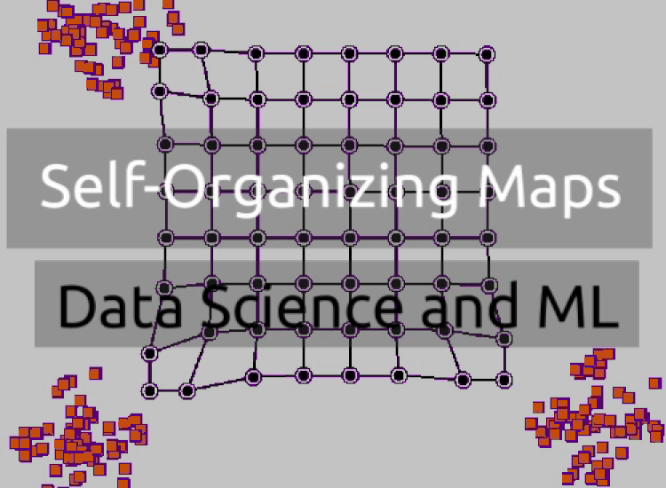

### Ресурсы

[Машинное обучение и Data Science (Часть 14): Применение карт Кохонена на рынках](https://www.mql5.com/ru/articles/12261)  
[Обзор алгоритмов кластеризации данных](https://habr.com/ru/articles/101338/)  
[Методы кластеризации: четкие и нечеткие.](https://alphacephei.com/ru/lecture7.pdf)  

