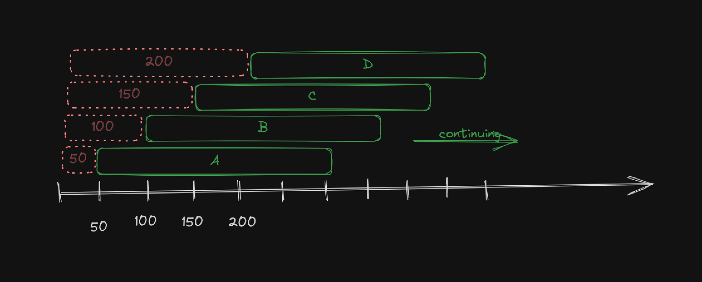

## Лаб 3. МОДЕЛИРОВАНИЕ ПРОСТОЙ СИСТЕМЫ МАССОВОГО ОБСЛУЖИВАНИЯ (СМО). 

Структура для хранения задач - приоритетная очередь. Она используется внутри класса QueueingSystem, также в нём реализован worker pool для конкуретного исполнения задач. 

Все подсчёты производятся в файле main.ts на основе выполненных задач.
Система заканчивает работу по окончании таймера  
Все данные в файле:  
[results.json](./results.json)

где:  
* **totalTime** - время засекаемое с начала и до конца работы системы
* **averageTasksTimeInSystem** - среднее время нахождения заявки в системе
* **averageTasksTimeInQueue**: среднее время ожидания в очереди
* **averageWorkerIdleTime**: среднее время простоя обслуживающего прибора
* **averageQueueLength**: средняя длина очереди
* **maxQueueLength**": максимальная длина очереди

критерий остановки работы - это окончание таймера **totalTime**  

краткое объяснение почему такой большой простой:

заявка появляется каждые 50 мс. В конце аналогичная картинке ситуация, ведь мы не учитываем те заявки, которые находятся в обработке в момент окончания, и в итоге это время засчитывается за простой.

### доп. материалы:
[теория массового обслуживания. хабр. яндекс](https://habr.com/ru/companies/yandex/articles/431650/)  
[Репозиторий с интерактивным деплоем на тему ТМО](https://github.com/vekrasikov/stochasticMassFlowSystems/tree/master)  